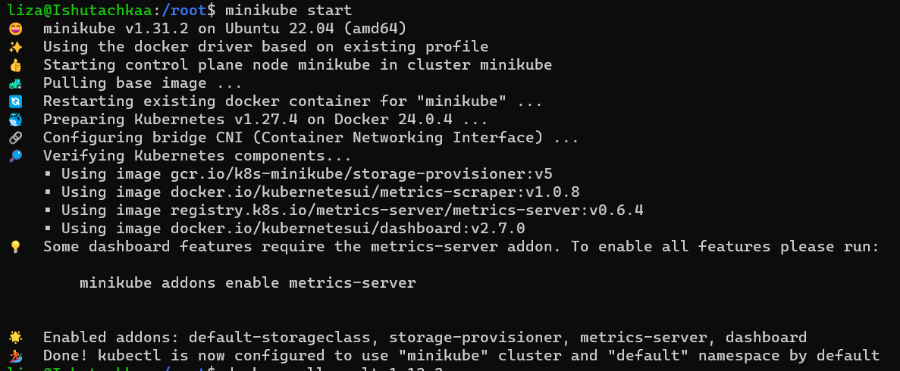
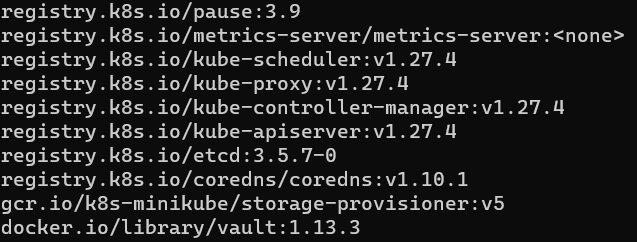
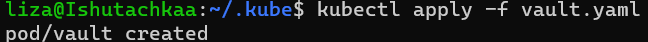
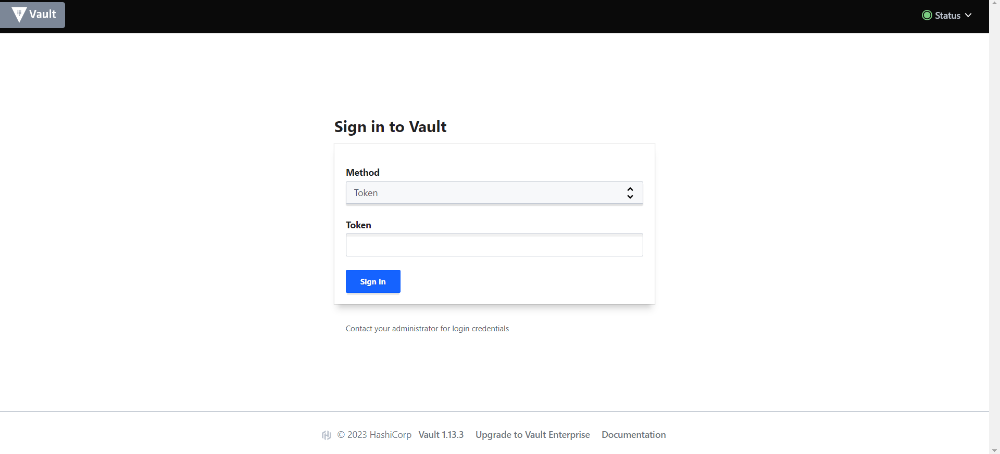
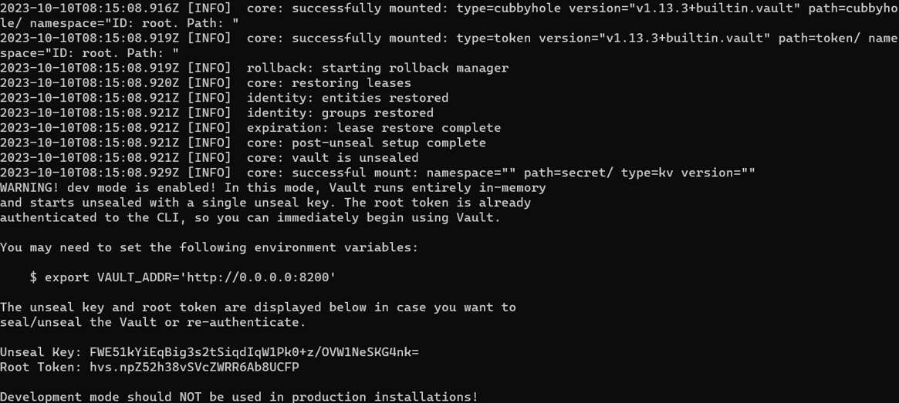
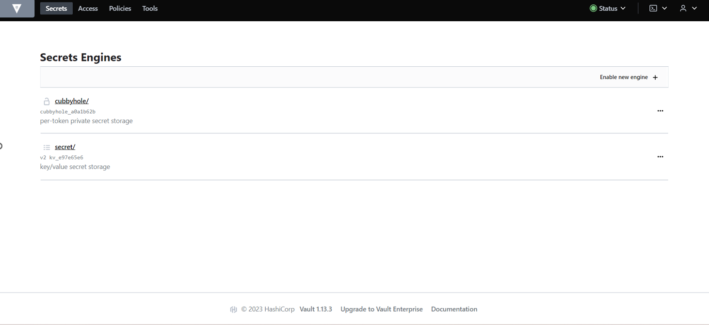

# 2023_2024-introduction_to_distributed_technologies-k4111c-ishutina_e
University: [ITMO University](https://itmo.ru/ru/)
Faculty: [FICT](https://fict.itmo.ru)
Course: [Introduction to distributed technologies](https://github.com/itmo-ict-faculty/introduction-to-distributed-technologies)
Year: 2023/2024
Group: K4111с
Author: Ishutina Yelizaveta
Lab: Lab1
Date of create: 05.09.2023
Date of finished: 

## Лабораторная работа №1 "Установка Docker и Minikube, мой первый манифест."

### Цель работы
Ознакомиться с инструментами Minikube и Docker, развернуть свой первый "под".

### Задачи
1. Установить Docker, minikube
2. Развернуть minikube cluster
3. Создать под Vault и получить доступ к контейнеру
4. Найти сгенерированный корневой токен, чтобы получить доступ к Vault.

### Ход работы
Изначально был установлен Docker Desktop для Windows и настроен WSL, в котором был установлен Minikube
После установки был развернут minikube cluster с помощью команды minikube start:
```bash
minikube start
```


Далее выполняются команды, которые добавляют на нашей локальной машине в список образов образ нужного ПО - Vault.
```bash
docker pull vault:1.13.3
docker images
```
Теперь посмотрим список образов с помощью следующих команд:
```bash
#просмотреть в minikube список всех образов
minikube image ls
```


В конце мы видим, что есть нужный нам образ vault:1.13.3

Следующим шагом было написание манифеста для развертывания "пода" (наименьший объект рабочей нагрузки)  HashiCorp Vault, и при этом прокинуть внутрь порт 8200.
Манифест (vault.yaml) прилигается в папке lab1.
Манифест составлялся в соответствии с object model Kubernetes.
Обязательные поля:
- `apiVersion` - используемая версия API;
- `kind` - тип описываемого объекта;
- `metadata` - метаданные;
- `spec` - конфигурация объекта;

Далее запускается описанный под с помощью команды:
```bash
minikube kubectl -- apply -f vault.yaml
```

Далее необходимо создать сервис для доступа к этому контейнеру, воспользуемся простым способом, с помощью команды:
```bash
minikube kubectl -- expose pod vault --type=NodePort --port=8200
```
Сервис создался, далее нужно попасть в контейнер с помощью команды `kubectl port-forward`:
```bash
minikube kubectl -- port-forward service/vault 8200:8200
```
Данная команда перенаправляет трафик с клиентского устройства по указанному порту (`8200`) на указанный порт (`8200`) сервиса пода vault (`service/vault`).
Minikube прокинул порт нашего компьютера в контейнер и теперь можем зайти в vault по ссылке http://localhost:8200


Теперь необходимо войти в наш vault ипользуя токен, который нам необходимо НАЙТИ, а не сгенерировать.
Для поиска токена, необходимого для входа воспользуемся `kubectl logs`, который используется для получения логов из контейнера в указанном поде:
```bash
minikube kubectl logs vault
```


Копируем данные Root Token и используем для входа в наш vault:


Вопросы:
1. Что сейчас произошло и что сделали команды ранее?

2. Где взять токен для входа в Vault?
Как было сказано раннее, Токен ищется, а не герериуется. Необходимо воспользоваться командой, описанной выше. 


Схема организации контейеров и сервисов нарисованная вами в draw.io или Visio.


